# AI Interview Coach

### Project 1 — Three-Tier AWS Deployment

**Project started August 2026 | Manual AWS deployment completed September 2026 | us-east-1**

AI Interview Coach is a Flask-based application that generates cloud and DevOps interview questions, accepts user responses, provides feedback, and stores completed interview sessions in PostgreSQL.

This project is being developed in stages so I can understand the full lifecycle of a cloud application — from a local prototype to manually deployed AWS infrastructure, Infrastructure as Code, containers, CI/CD, and eventually Kubernetes.

---

## Live Deployment

**Live App:**  
http://icoach-alb-1227578735.us-east-1.elb.amazonaws.com/

The application is currently deployed on AWS behind an internet-facing Application Load Balancer.

HTTPS and a custom domain are planned for a later iteration.

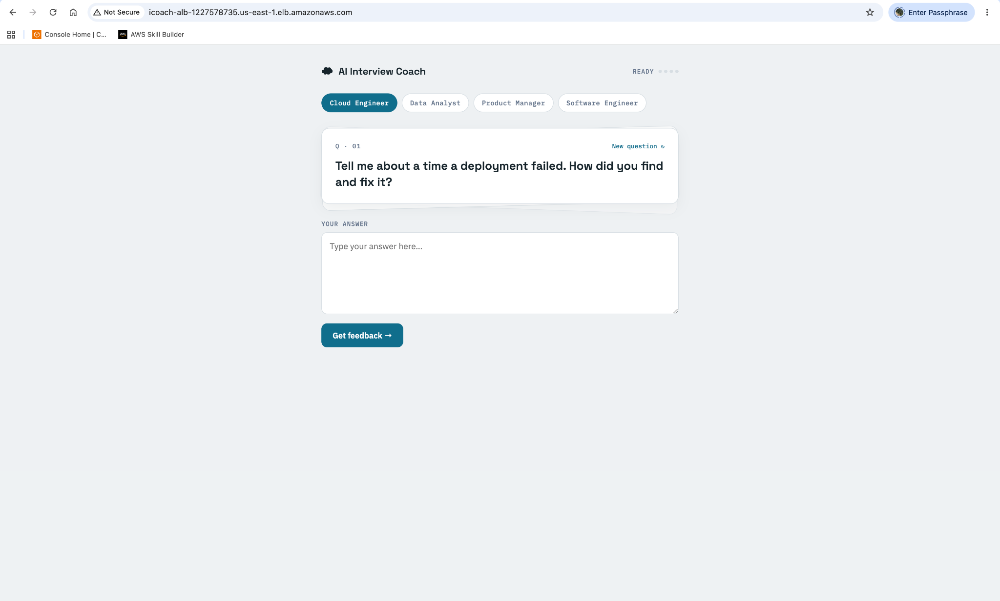

---

## Project Evolution

The project started as a locally running application where I focused first on getting the application workflow working correctly.

After validating the application locally, I moved the same application to AWS and manually built the infrastructure through the AWS Console.

The goal of building manually first was to understand what each AWS component does, how the components communicate, and what happens when part of the architecture fails before automating the infrastructure with Terraform.

### Phase 0 — Local Prototype

Built and tested the application locally to validate:

- Flask application workflow
- Interview question generation
- User response handling
- Feedback generation
- PostgreSQL integration
- Session persistence

### Phase 1 — Manual AWS Deployment ✅

The application was then deployed manually on AWS using a custom three-tier architecture.

This phase focuses on:

- Networking
- Load balancing
- Auto Scaling
- Private application infrastructure
- Database isolation
- Content delivery
- Security groups
- Monitoring
- Alerting
- Failure testing
- Recovery testing

### Next Phases

- **Phase 2 — Terraform / Infrastructure as Code**
- **Phase 3 — Docker**
- **Phase 4 — CI/CD**
- **Phase 5 — Kubernetes / Amazon EKS**

The same application will continue through each phase so the repository shows the evolution of one system rather than a collection of unrelated demos.

---

# Architecture

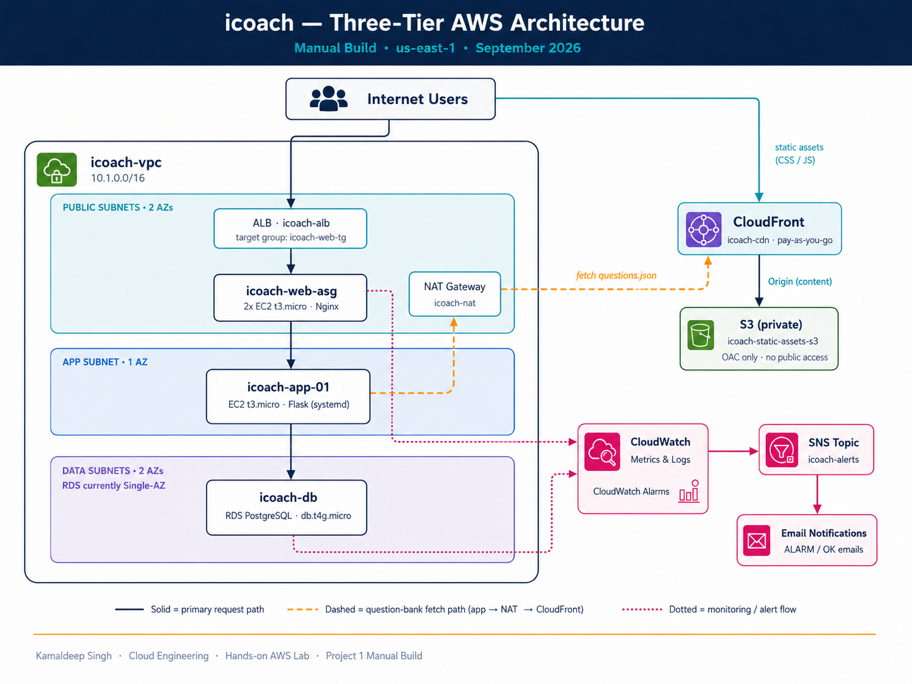

### Primary Request Flow

```text
Internet User
      ↓
Application Load Balancer
      ↓
Web Tier — Nginx / Auto Scaling Group
      ↓
App Tier — Flask / systemd
      ↓
Amazon RDS PostgreSQL
```

### Question Bank Flow

```text
Private App EC2
      ↓
NAT Gateway
      ↓
Amazon CloudFront
      ↓
Private Amazon S3 Bucket
      ↓
data/questions.json
```

### Monitoring Flow

```text
AWS Resource / Metric
      ↓
Amazon CloudWatch
      ↓
CloudWatch Alarm
      ↓
Amazon SNS
      ↓
Email Notification
```

---

## Architecture at a Glance

| Layer | Implementation |
|---|---|
| Networking | Custom VPC with 6 subnets across 2 Availability Zones |
| Load Balancing | Internet-facing Application Load Balancer |
| Web Tier | Nginx EC2 instances in an Auto Scaling Group |
| App Tier | Private Flask EC2 instance managed by systemd |
| Database | Private Amazon RDS PostgreSQL |
| Content Delivery | Private S3 bucket behind CloudFront using OAC |
| Monitoring | CloudWatch alarms with SNS email notifications |
| Security | Security-group-to-security-group communication between tiers |
| Availability | Web tier spans 2 AZs; app and database remain single-instance / Single-AZ in this version |

---

# Networking

The infrastructure runs inside a custom VPC.

**VPC CIDR:** `10.1.0.0/16`  
**Region:** `us-east-1`

| Subnet | CIDR | Purpose |
|---|---|---|
| Public 1a | `10.1.0.0/24` | ALB, web tier, NAT Gateway |
| Public 1b | `10.1.1.0/24` | ALB, web tier |
| App 1a | `10.1.10.0/24` | Flask application tier |
| App 1b | `10.1.11.0/24` | Reserved for future Multi-AZ app deployment |
| Data 1a | `10.1.20.0/24` | RDS |
| Data 1b | `10.1.21.0/24` | RDS subnet group / future Multi-AZ use |

### Routing

- Public subnets route internet-bound traffic through the Internet Gateway.
- Private application subnets use a NAT Gateway for required outbound access.
- Database subnets have no internet route.

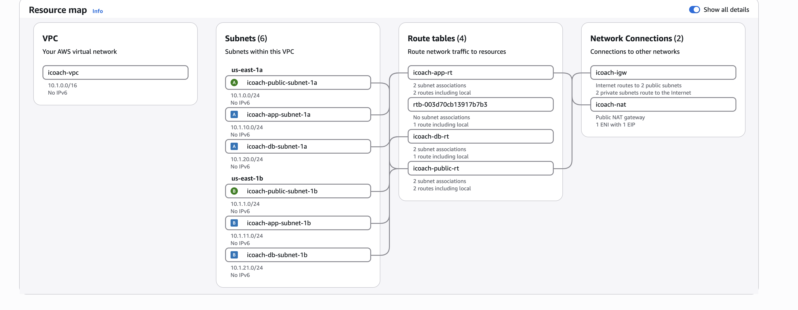

---

# Security Design

Communication between the application tiers is restricted using security-group references rather than broadly exposing application ports.

```text
Internet
   ↓ HTTP 80
icoach-alb-sg
   ↓ HTTP 80
icoach-web-sg
   ↓ TCP 5000
icoach-app-sg
   ↓ PostgreSQL 5432
icoach-db-sg
```

### Traffic Rules

- Internet → `icoach-alb-sg` : `80`
- `icoach-alb-sg` → `icoach-web-sg` : `80`
- `icoach-web-sg` → `icoach-app-sg` : `5000`
- `icoach-app-sg` → `icoach-db-sg` : `5432`

### Administrative Access

During the manual build, the web tier was also used as an administrative jump point.

```text
Admin IP
   ↓ SSH 22
Web Tier
   ↓ SSH 22
App Tier
```

The deployed application itself does **not** depend on an active SSH session.

CloudFront and S3 are outside this security-group chain. Access to the private S3 bucket is controlled using CloudFront Origin Access Control and the S3 bucket policy.

---

# Web Tier — ALB and Auto Scaling

The web tier uses Nginx EC2 instances behind an internet-facing Application Load Balancer.

### Application Load Balancer

- Internet-facing
- Spans both public subnets
- HTTP listener on port `80`
- Forwards requests to `icoach-web-tg`
- Health check path: `/`

Both web targets were validated as healthy across two Availability Zones.

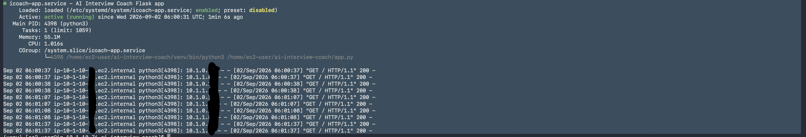

### Auto Scaling Group

The web instances are managed by `icoach-web-asg`.

```text
Desired capacity: 2
Minimum capacity: 2
Maximum capacity: 4
```

The web tier uses:

- Amazon Linux 2023
- Nginx reverse proxy
- Two Availability Zones
- Automatic target registration and deregistration
- Target tracking based on average CPU utilization

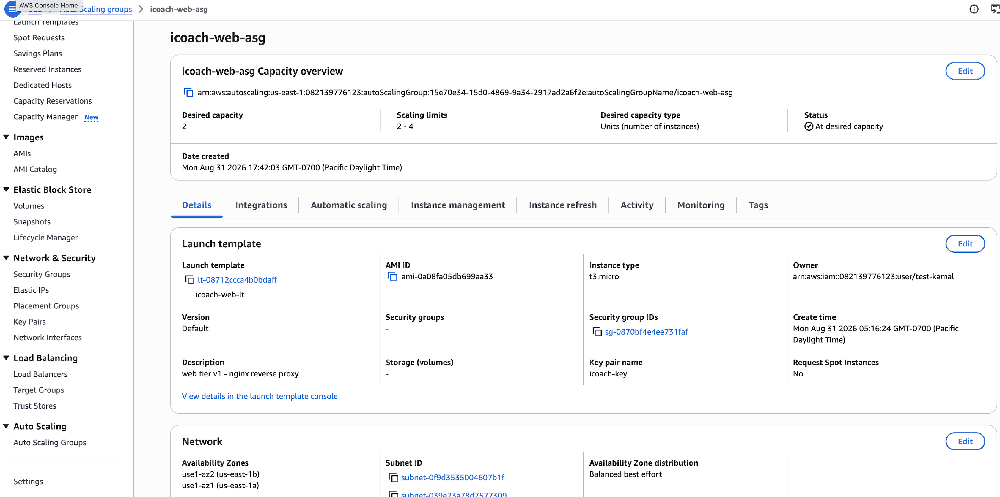

---

# Application Tier — Flask + systemd

The Flask application runs on a private EC2 instance with no public IP address.

Nginx on the web tier forwards application requests to Flask on port `5000`.

Originally, the application was started manually:

```bash
python3 app.py
```

This created an operational problem because the application process depended on the shell session.

I converted the application into a `systemd` service so that it could run independently of SSH.

### Service Configuration

```text
Service: icoach-app
User: ec2-user
Working directory: /home/ec2-user/ai-interview-coach
Restart policy: Restart=always
Boot behavior: enabled
```

This provides:

- Automatic startup during boot
- Automatic process restart
- Independence from SSH sessions
- Consistent service management

The application was verified with no active SSH session while requests continued returning HTTP `200`.

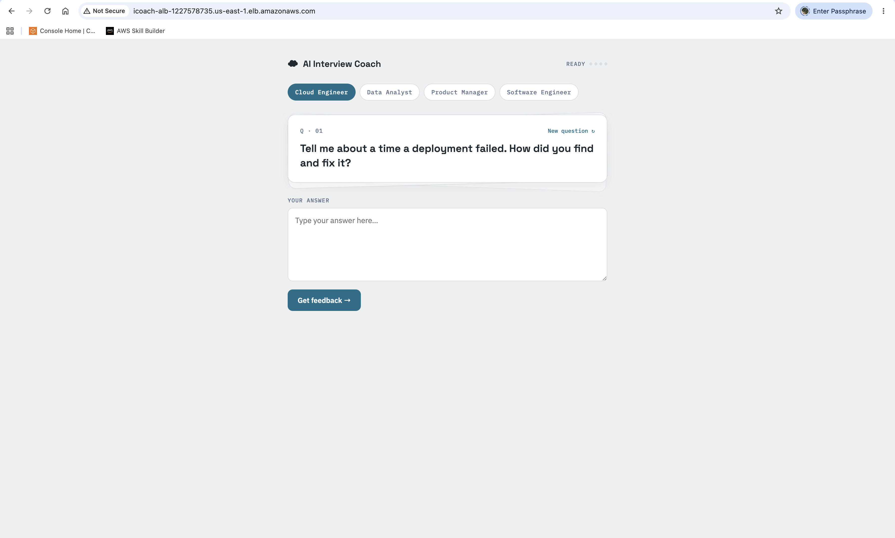

---

# Database — Amazon RDS PostgreSQL

The application stores completed interview sessions in a private Amazon RDS PostgreSQL database.

### Configuration

```text
Engine: PostgreSQL
Instance class: db.t4g.micro
Storage: 20 GB
Public access: Disabled
Encryption: Enabled
```

The database accepts PostgreSQL traffic only from the application-tier security group on port `5432`.

The `sessions` table stores:

```text
id
role
question
answer
feedback
created_at
```

Multiple completed interview sessions were successfully persisted to PostgreSQL.

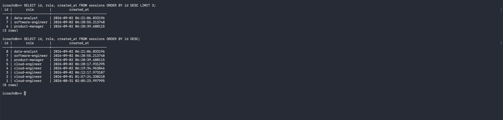

The database remains **Single-AZ** in this learning environment.

I originally planned to use a Multi-AZ RDS deployment, but the additional cost was not justified for this project and did not fit the cost constraints of the environment I was using.

I therefore kept the database Single-AZ as a deliberate cost-optimization decision while still using a DB subnet group that spans both Availability Zones.

This keeps a clear path open for a future Multi-AZ deployment when the workload or availability requirements justify the additional cost.

---

# S3 + CloudFront

The interview question bank was moved out of `app.py` and into Amazon S3.

The bucket contains:

```text
/data/questions.json
/static/style.css
/static/script.js
```

The S3 bucket is private:

- Block Public Access enabled
- ACLs disabled
- Server-side encryption enabled
- CloudFront accesses S3 using Origin Access Control

The Flask application does **not** access S3 directly.

Instead, it retrieves the question bank through CloudFront:

```text
Private App EC2
      ↓
NAT Gateway
      ↓
CloudFront HTTPS Endpoint
      ↓
Private S3 Origin
      ↓
data/questions.json
```

A small fallback question set remains inside the application so the service can still start if the external question-bank request fails.

---

# Monitoring & Alerting — CloudWatch + SNS

Monitoring was added using Amazon CloudWatch and Amazon SNS.

An SNS topic named:

```text
icoach-alerts
```

was connected to a confirmed email subscription.

### CloudWatch Alarms

| Alarm | Metric | Threshold |
|---|---|---|
| `icoach-web-unhealthy-1a` | UnHealthyHostCount — us-east-1a | ≥ 1 for 2/2 datapoints at 1-minute intervals |
| `icoach-web-unhealthy-1b` | UnHealthyHostCount — us-east-1b | ≥ 1 for 2/2 datapoints at 1-minute intervals |
| `icoach-db-cpu-high` | RDS CPUUtilization | > 70% for 2/2 datapoints at 1-minute intervals |

Both **ALARM** and **OK** state transitions publish notifications through SNS.

```text
AWS Resource / Metric
      ↓
Amazon CloudWatch
      ↓
CloudWatch Alarm
      ↓
Amazon SNS
      ↓
Email Notification
```

---

# Failure and Recovery Test

Monitoring was not left untested.

I deliberately stopped the Flask application service:

```bash
sudo systemctl stop icoach-app
```

The result was:

- Web-tier health checks failed
- Both Availability Zone health alarms entered `ALARM`
- CloudWatch detected the unhealthy state
- SNS delivered real failure notifications

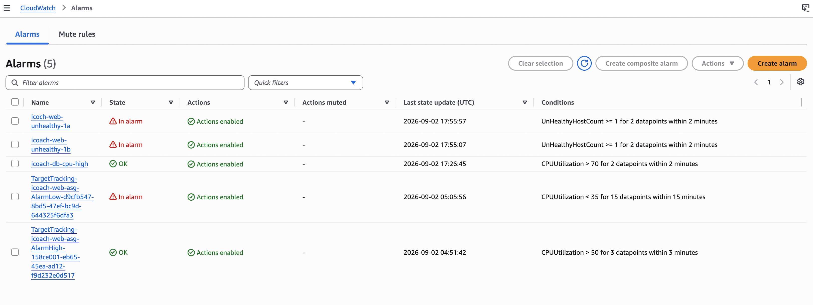

SNS then delivered the alarm notification by email.

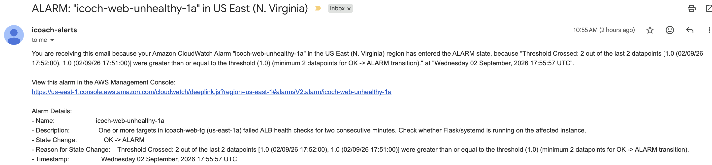

The application was restored with:

```bash
sudo systemctl start icoach-app
```

After recovery:

- Application health returned
- ALB target health recovered
- CloudWatch alarms returned to `OK`
- SNS delivered recovery notifications

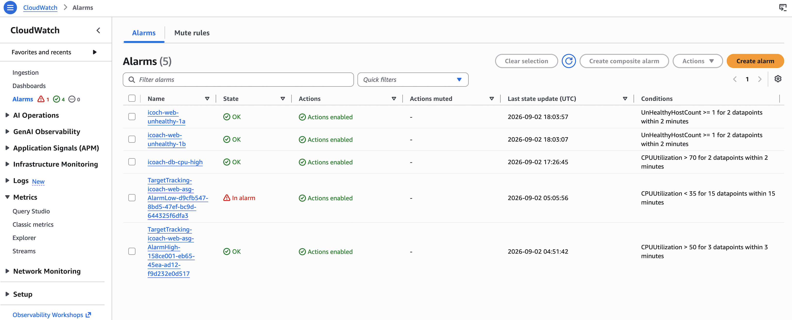

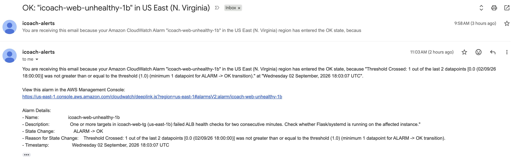

### Failure / Recovery Flow

```text
Healthy
   ↓
Intentional application failure
   ↓
Health checks fail
   ↓
CloudWatch enters ALARM
   ↓
SNS sends alert
   ↓
Service restored
   ↓
Health checks recover
   ↓
CloudWatch returns to OK
   ↓
SNS sends recovery notification
```

---

# What the Failure Test Revealed

The web tier spans two Availability Zones.

However, both web-tier instances currently depend on the **same single application-tier EC2 instance**.

When the application instance was stopped, health checks failed across both web-tier Availability Zones.

This demonstrated an important architecture lesson:

> Multi-AZ redundancy in one tier does not eliminate a single point of failure in a downstream tier.

The app tier is therefore the highest-priority availability improvement for the next architecture iteration.

Current:

```text
Web ASG across 2 AZs
        ↓
Single App EC2
        ↓
Single-AZ RDS
```

Future application tier:

```text
Web Tier
    ↓
Internal ALB
    ↓
App Auto Scaling Group
    ↓
App Instances across multiple AZs
```

---

# Engineering Decisions and Tradeoffs

## Manual Build Before Terraform

The architecture was deliberately built manually before introducing Infrastructure as Code.

This allowed me to understand:

- Subnet placement
- Route tables
- Internet Gateway routing
- NAT Gateway routing
- Security-group relationships
- ALB behavior
- Target health
- Auto Scaling
- Private EC2 connectivity
- RDS networking
- CloudFront and S3 integration
- CloudWatch alarms
- SNS notifications

The next phase will recreate these infrastructure decisions using Terraform.

## Security-Group References Instead of Broad Access

Application ports are not open broadly.

```text
Port 5000 → allowed only from icoach-web-sg
Port 5432 → allowed only from icoach-app-sg
```

This limits communication to the tier that actually requires access.

## systemd Instead of a Foreground Process

Running the Flask application through `systemd` provides:

- Startup during boot
- Independence from SSH
- Automatic restart if the process exits
- Consistent service control

## Web Tier Scaled Before App Tier

The web tier uses Auto Scaling across two Availability Zones.

The application tier remains a single instance in this version because the initial goal was to understand the architecture while keeping the learning environment appropriate to the workload and cost.

The later failure test exposed the availability limitation of this design.


## Single-AZ RDS — Cost Optimization

I originally planned to use Multi-AZ RDS to add database failover capability.

For this learning environment, the additional cost was not justified, so I deliberately kept PostgreSQL Single-AZ.

The database subnet group still includes subnets in both Availability Zones, which leaves a clear path for a future Multi-AZ deployment.

This was a cost-versus-availability tradeoff rather than an architectural assumption that Single-AZ is sufficient for production.

## CloudFront in Front of Private S3

The application could access S3 directly using IAM and the AWS SDK.

In this version, the question bank is retrieved through CloudFront while the S3 origin remains private through Origin Access Control.

## Monitoring Tested Through Failure

CloudWatch and SNS were tested by deliberately stopping and restoring the application service.

This validated the complete path:

```text
Failure
→ Detection
→ Alarm
→ Notification
→ Recovery
→ Health verification
→ Recovery notification
```

---

# Known Gaps / Next Iteration

## 1. App-Tier High Availability — Highest Priority

Current:

```text
Single private App EC2
```

Future:

```text
Internal ALB
+
App Auto Scaling Group
+
App instances across multiple AZs
```

## 2. HTTPS

Current:

```text
HTTP :80
```

Future:

```text
ACM Certificate
+
HTTPS :443 Listener
+
HTTP → HTTPS Redirect
```

## 3. Multi-AZ RDS

Current:

```text
Single-AZ PostgreSQL
```

I originally planned to use a Multi-AZ RDS deployment, but the additional cost was not justified for this learning environment.

I therefore kept the database Single-AZ as a deliberate cost-optimization decision. The DB subnet group still spans both Availability Zones, so the architecture is already prepared for a future Multi-AZ deployment.

Future:

```text
Multi-AZ RDS Deployment
```

This upgrade would be implemented when the workload and availability requirements justify the additional cost.

## 4. Secrets Management

Before creating a reusable application-tier AMI, application credentials should be moved into AWS Secrets Manager.

Credentials should never be baked into an AMI.

## 5. Static Assets Through CloudFront

CSS and JavaScript files are already stored in S3, but the current templates still reference locally served copies.

A future iteration will serve those static assets through CloudFront.

## 6. Custom Domain

Planned services:

- Amazon Route 53
- Custom DNS
- AWS Certificate Manager
- HTTPS

---

# Validation

The completed manual deployment was validated end to end:

- Application accessible through the ALB
- Both web-tier targets healthy
- Auto Scaling maintaining desired capacity
- Flask running without an active SSH session
- Nginx successfully proxying to the application tier
- Interview questions retrieved through CloudFront
- Interview sessions successfully written to RDS
- RDS not directly reachable from the public internet
- CloudWatch alarms transitioned from `OK` to `ALARM`
- SNS delivered real failure notifications
- Intentional application failure was detected
- Application recovery was confirmed
- CloudWatch returned from `ALARM` to `OK`
- SNS delivered recovery notifications
- Failure testing exposed the single application instance as an availability bottleneck

---

# Technology Stack

### AWS

- Amazon VPC
- Amazon EC2
- Application Load Balancer
- EC2 Auto Scaling
- Amazon RDS PostgreSQL
- Amazon S3
- Amazon CloudFront
- Amazon CloudWatch
- Amazon SNS
- Internet Gateway
- NAT Gateway
- IAM
- AWS Secrets Manager *(planned)*

### Application / Operating System

- Python
- Flask
- PostgreSQL
- Nginx
- systemd
- Amazon Linux 2023

---

# Project Roadmap

| Phase | Focus | Status |
|---|---|---|
| Phase 0 | Local Application Prototype | ✅ Complete |
| Phase 1 | Manual AWS Deployment | ✅ Complete |
| Phase 2 | Terraform / Infrastructure as Code | ⏭️ Next |
| Phase 3 | Docker | Planned |
| Phase 4 | CI/CD | Planned |
| Phase 5 | Kubernetes / Amazon EKS | Planned |

The same application will continue through each phase so the repository demonstrates progression from application development to cloud infrastructure, automation, containers, deployment pipelines, and orchestration.

---

# Supporting Technical Evidence

Additional AWS console screenshots from the manual deployment are stored here:

[View supporting AWS infrastructure evidence](docs/screenshots/evidence/)

These include supporting configuration evidence for the ALB, Auto Scaling activity, launch templates, security groups, RDS, S3, CloudFront, and related infrastructure.

---

# Project Status

**Phase 1 — Manual AWS Deployment: Complete ✅**

The environment has been deployed and validated end to end.

**Live App:**  
http://icoach-alb-1227578735.us-east-1.elb.amazonaws.com/

### Next Milestone

Rebuild the same AWS infrastructure using **Terraform** and manage the environment as Infrastructure as Code.

---

**Built and documented by Kamaldeep Singh — August–September 2026**
