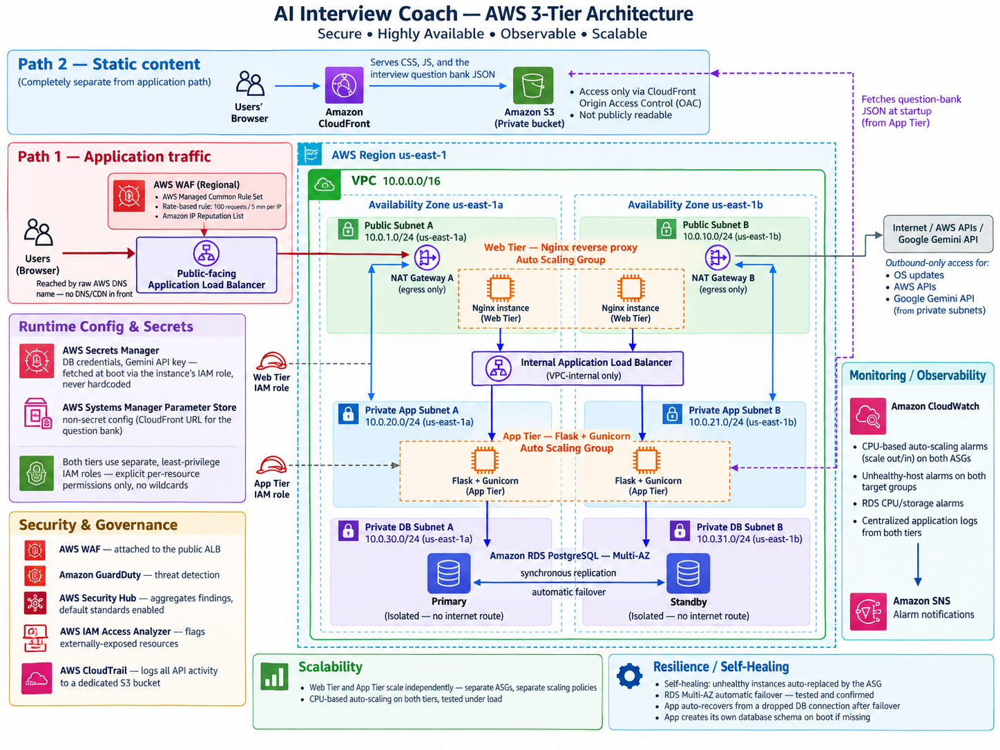
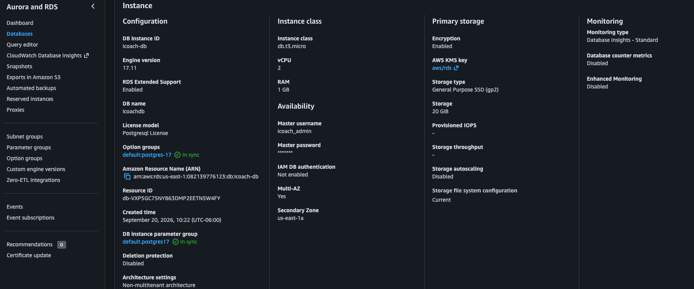
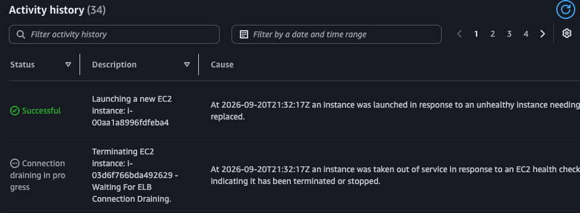
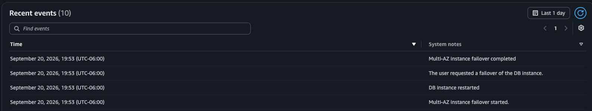
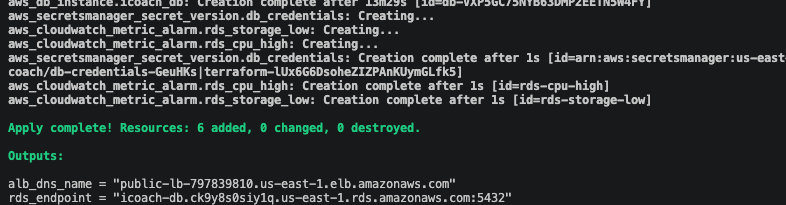
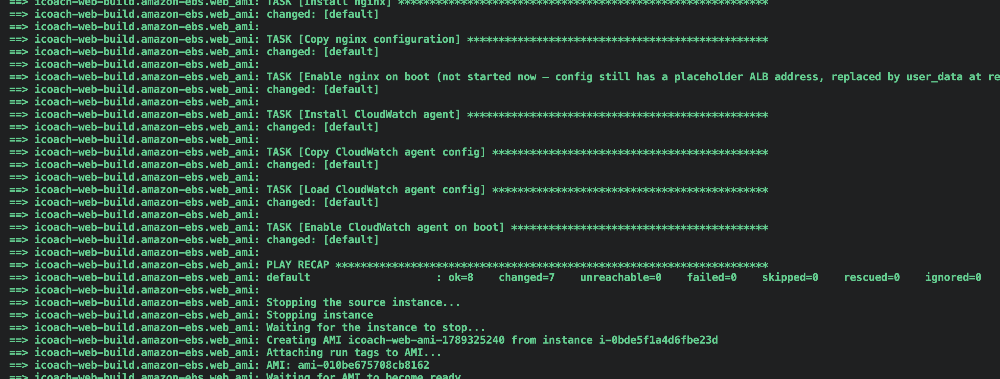
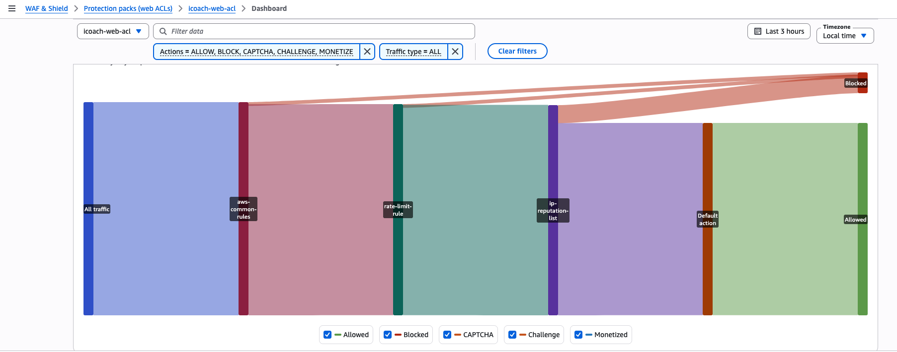
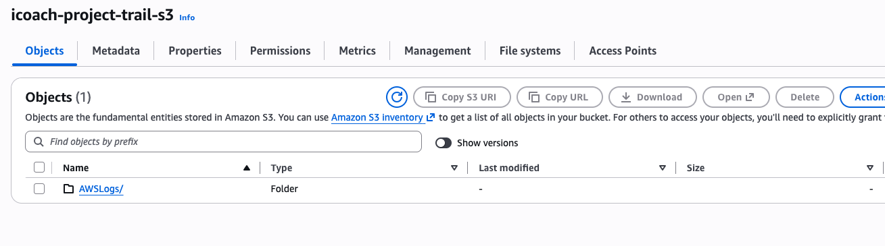
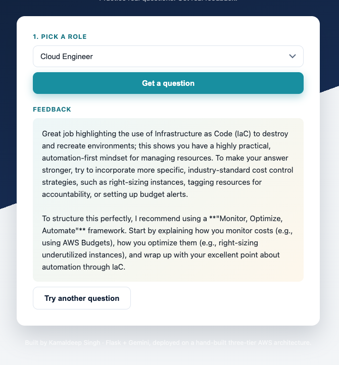

# AI Interview Coach

A Flask web application that gives candidates role-specific interview questions and AI-generated feedback using Google Gemini.

The application runs on a **Terraform-managed, multi-AZ AWS architecture designed around high availability, redundancy, layered security, network segmentation, observability, and least-privilege access**.

The infrastructure in this repository was provisioned, tested, failure-tested, troubleshot, and hardened on real AWS infrastructure.

---

## What the Application Does

Users can choose from four interview tracks:

- Cloud Engineer
- Software Engineer
- Data Analyst
- Product Manager

The application then:

1. retrieves a randomized interview question;
2. accepts the user's answer;
3. sends the response to Google Gemini;
4. returns concise AI-generated feedback;
5. stores the completed interview session in PostgreSQL.

---

# Architecture



## Application Traffic

```text
Users
  |
  v
Public Application Load Balancer
  |
AWS WAF
  |
  v
Web Tier
Nginx
Auto Scaling Group
Multi-AZ
  |
  v
Internal Application Load Balancer
  |
  v
App Tier
Flask + Gunicorn
Auto Scaling Group
Multi-AZ
  |
  v
Amazon RDS PostgreSQL
Multi-AZ
Primary + Standby
```

The public application is accessed directly through the AWS-generated DNS name of the internet-facing Application Load Balancer.

There is no Route 53 custom domain in front of the application.

---

## Static Content Path

Static content follows a separate path and does not pass through the application load balancers.

```text
Browser
   |
   v
Amazon CloudFront
   |
   v
Private Amazon S3
   |
   +--> CSS
   +--> JavaScript
   +--> Question Bank JSON
```

The S3 bucket is private and is accessed through CloudFront Origin Access Control.

The application tier also retrieves the question bank through CloudFront during startup.

---

# Architecture Goals

The Phase 2 environment was built around four main engineering goals:

- High availability
- Redundancy
- Layered security
- Least privilege

Terraform, Packer, and Ansible are the automation tools used to implement those design goals.

---

# High Availability

The web and application tiers are distributed across two Availability Zones.

Each tier uses:

- multiple EC2 instances;
- an Auto Scaling Group;
- target-group health checks;
- load balancing;
- automatic instance replacement.

Amazon RDS PostgreSQL is configured as a **Multi-AZ deployment** with a synchronous standby.



This removes the single-instance dependencies that existed in earlier versions of the project.

---

# Multi-AZ Network Design

The infrastructure runs in a custom VPC:

```text
10.0.0.0/16
```

across:

```text
us-east-1a
us-east-1b
```

## Public Subnets

```text
Public Subnet A
10.0.1.0/24
us-east-1a

Public Subnet B
10.0.10.0/24
us-east-1b
```

These subnets contain:

- web-tier EC2 instances;
- NAT Gateway A;
- NAT Gateway B.

---

## Private Application Subnets

```text
Private App Subnet A
10.0.20.0/24
us-east-1a

Private App Subnet B
10.0.21.0/24
us-east-1b
```

These subnets contain the Flask/Gunicorn application tier.

---

## Private Database Subnets

```text
Private DB Subnet A
10.0.30.0/24
us-east-1a

Private DB Subnet B
10.0.31.0/24
us-east-1b
```

These subnets contain the RDS Multi-AZ deployment.

The database subnets do not have a direct internet route.

---

# Availability-Zone Independence

The architecture avoids making one Availability Zone the required transit path for the other.

Each AZ has:

- its own public subnet;
- its own private application subnet;
- its own database subnet;
- web capacity;
- application capacity;
- NAT connectivity.

This reduces unnecessary cross-AZ dependencies and allows infrastructure in each AZ to operate through its own network path.

---

# NAT Gateways

A NAT Gateway exists in each public subnet.

```text
Private resources
      |
      v
AZ-local NAT Gateway
      |
      v
Internet
```

The NAT Gateways provide outbound access for private application instances when required for:

- operating-system updates;
- AWS API communication;
- external API calls;
- Google Gemini API access.

Private instances do not need inbound internet exposure.

---

# Network ACLs

Separate Network ACLs are used as part of the subnet-level security model.

Security groups provide **stateful resource-level filtering**, while NACLs provide an additional **stateless subnet-level boundary**.

The separate NACL design helps:

- make allowed network paths explicit;
- restrict unnecessary traffic;
- reduce unnecessary cross-zone communication;
- provide another layer of network defense;
- limit the blast radius of network-level mistakes or unwanted traffic.

The NACLs support the multi-AZ design but are not themselves the source of high availability.

---

# Web Tier

The web tier runs Nginx on EC2 instances managed by an Auto Scaling Group.

```text
Public ALB
   |
   v
Web Target Group
   |
   v
Nginx EC2 Instances
AZ A + AZ B
```

Nginx acts as the reverse proxy between the public-facing load balancer and the private application tier.

The web instances do not point directly at an individual application EC2 address.

Instead, requests are forwarded through the internal Application Load Balancer.

---

# Application Tier

The application tier runs:

```text
Flask
Gunicorn
systemd
```

on private EC2 instances managed by an Auto Scaling Group.

```text
Web Tier
   |
   v
Internal ALB
   |
   v
App Target Group
   |
   +---------------------+
   |                     |
   v                     v
App EC2               App EC2
AZ A                  AZ B
```

Using the internal ALB removes direct dependency on specific application-instance IP addresses.

Application instances can be replaced without changing the Nginx upstream configuration.

---

# Auto Scaling and Self-Healing

Both the web tier and application tier use Auto Scaling Groups.

The application tier was deliberately failure-tested by terminating an ASG-managed instance.

```text
Instance terminated
      |
      v
Healthy capacity decreases
      |
      v
Auto Scaling detects the gap
      |
      v
Replacement EC2 launches
      |
      v
Health checks pass
      |
      v
Target becomes healthy
```

No manual EC2 replacement was required.



This makes the application instances disposable infrastructure rather than permanent servers.

---

# Amazon RDS PostgreSQL

PostgreSQL runs on Amazon RDS inside isolated private database subnets.

The database is:

- not publicly accessible;
- reachable only through the required application security path;
- configured for Multi-AZ operation;
- protected by security-group controls.

## Multi-AZ Failover

RDS failover was deliberately tested.

AWS recorded successful completion of the Multi-AZ failover.



The test also exposed an application-level problem.

Existing pooled database connections could remain tied to a dead connection after failover.

The application was updated so a failed database connection is:

```text
detected
   |
   v
discarded
   |
   v
replaced
   |
   v
request retried once
```

This allows the application to recover from a dropped database connection after an RDS failover.

---

# Application Reliability Features

Infrastructure redundancy alone does not guarantee application reliability.

The application includes several recovery behaviors discovered through testing.

## Database Connection Recovery

Dead database connections are discarded and replaced before retrying the operation.

This behavior was added after the Multi-AZ RDS failover test.

## Database Schema Initialization

The application verifies that its required PostgreSQL schema exists during startup.

If the required table is missing, the application creates it automatically.

This prevents a fresh environment from failing only because a manual database initialization step was missed.

## Question Bank Fallback

If the external question bank cannot be retrieved, the application can fall back to a small built-in emergency set rather than crashing.

---

# Infrastructure as Code

The AWS environment is defined using Terraform.

Terraform manages resources including:

- VPC
- subnets
- route tables
- NAT Gateways
- Network ACLs
- security groups
- IAM roles and policies
- public Application Load Balancer
- internal Application Load Balancer
- target groups
- launch templates
- Auto Scaling Groups
- scaling policies
- Amazon RDS
- S3
- CloudFront
- Secrets Manager
- SSM Parameter Store
- CloudWatch
- SNS
- AWS WAF
- GuardDuty
- Security Hub
- CloudTrail
- AWS Config
- IAM Access Analyzer



The infrastructure definition lives in code rather than depending on undocumented AWS Console configuration.

---

# Terraform Remote State

Terraform state is stored remotely in Amazon S3 rather than on the local development machine.

The backend is hosted in **us-east-2**, separate from the application infrastructure region.

```hcl
backend "s3" {
  bucket       = "kamaldeepsingh-terraform-state-2026"
  key          = "ai-interview-coach/terraform.tfstate"
  region       = "us-east-2"
  encrypt      = true
  use_lockfile = true
}
```

The remote backend provides:

- centralized Terraform state;
- encryption at rest;
- native S3 state locking;
- protection against concurrent Terraform operations;
- separation between application infrastructure and state storage;
- recovery if the local development machine is lost.

Terraform state files are not stored in this Git repository.

---

# Packer and Ansible

EC2 machine images are built with **Packer** and configured using **Ansible**.

```text
Packer
   |
   v
Temporary EC2 Builder
   |
   v
Ansible
   |
   v
Configured AMI
   |
   v
Terraform Launch Template
   |
   v
Auto Scaling Group
```

Separate images are built for the web and application tiers.

Ansible configures components such as:

- Nginx;
- Gunicorn;
- systemd;
- CloudWatch Agent;
- service configuration;
- application dependencies.



This makes machine-image creation reproducible instead of requiring manual package installation after an instance launches.

---

# Secrets Manager

Sensitive application values are stored in AWS Secrets Manager.

Examples include:

```text
Database credentials
Gemini API key
```

The application retrieves these secrets at runtime using the EC2 instance IAM role.

Secrets are not:

- hardcoded into application source;
- stored in the repository;
- baked permanently into the AMI.

---

# Systems Manager Parameter Store

Non-secret runtime configuration is stored separately in AWS Systems Manager Parameter Store.

One example is the CloudFront URL used for retrieving the interview question bank.

This keeps:

```text
application code
machine images
secrets
runtime configuration
```

separated from each other.

---

# Least-Privilege IAM

The web and application tiers use separate IAM roles.

Policies are scoped to the resources and actions required by each tier.

For example, application instances can retrieve required secrets through:

```text
secretsmanager:GetSecretValue
```

against specific secret resources rather than unrestricted access.

The goal is to avoid broad wildcard permissions wherever specific resource permissions can be used.

---

# Security Group Segmentation

Security groups provide tier-specific communication boundaries.

```text
Internet
   |
   v
Public ALB Security Group
   |
   v
Web Tier Security Group
   |
   v
Internal ALB Security Group
   |
   v
App Tier Security Group
   |
   v
Database Security Group
```

Each layer only accepts the traffic required from the previous trusted layer.

---

# AWS WAF

AWS WAF is attached directly to the **public Application Load Balancer** using Regional scope.

Application traffic does not pass through CloudFront.

The WAF rules include:

- AWS Managed Common Rule Set;
- rate-based protection;
- Amazon IP Reputation List.

The rate-based rule limits a single IP to:

```text
100 requests / 5 minutes
```



WAF provides an application-edge security layer before requests reach the web tier.

---

# Amazon GuardDuty

Amazon GuardDuty is enabled for managed threat detection.

It provides additional visibility into potentially suspicious AWS activity and network-related behavior.

---

# AWS Security Hub

AWS Security Hub is enabled with default security standards.

It provides a centralized view of security findings from supported AWS security services.

---

# IAM Access Analyzer

An account-level IAM Access Analyzer is provisioned through Terraform.

```text
icoach-iam-access-analyzer
```

Its purpose is to identify resource policies that may allow access outside the intended trust boundary.

---

# AWS CloudTrail

AWS CloudTrail records AWS API activity for the environment.

CloudTrail logs are delivered to a dedicated S3 audit bucket.

The bucket policy grants the CloudTrail service the permissions required to:

- validate the bucket;
- write audit logs.



CloudTrail provides infrastructure-level audit visibility for actions such as:

```text
resource creation
resource modification
IAM activity
security changes
configuration changes
```

---

# AWS Config

AWS Config is enabled through Terraform.

The implementation includes:

- an AWS Config IAM service role;
- configuration recorder;
- recording of supported AWS resources;
- S3 delivery channel;
- enabled recorder status.

Configuration history is delivered to the audit S3 bucket.

AWS Config complements CloudTrail by recording resource configuration state and changes over time.

---

# Monitoring and Observability

Amazon CloudWatch provides centralized metrics and logs.

Monitoring includes:

- web-tier CPU;
- application-tier CPU;
- Auto Scaling scale-out alarms;
- Auto Scaling scale-in alarms;
- unhealthy target alarms;
- RDS CPU;
- RDS storage;
- system logs;
- application logs.

Amazon SNS is used for alarm notifications.

The CloudWatch Agent is installed through the Packer/Ansible AMI build so instances can send operating-system and application logs to centralized CloudWatch log groups.

---

# S3 and CloudFront

The application uses private Amazon S3 storage behind CloudFront.

```text
CloudFront
     |
     v
Private S3
     |
     +--> CSS
     +--> JavaScript
     +--> Question Bank JSON
```

CloudFront uses Origin Access Control so the bucket does not need to be publicly readable.

This static-content path remains separate from the application's ALB/WAF path.

---

# Final Application Validation

The completed infrastructure was validated end to end with the application running through the Terraform-built environment.

Validation included:

- public ALB application access;
- WAF enforcement;
- healthy web targets;
- healthy app targets;
- web-tier Auto Scaling;
- app-tier Auto Scaling;
- automatic EC2 replacement;
- internal ALB routing;
- Secrets Manager retrieval;
- SSM Parameter Store configuration retrieval;
- CloudFront question-bank delivery;
- private S3 access through OAC;
- Gemini API feedback;
- PostgreSQL persistence;
- RDS Multi-AZ operation;
- forced database failover;
- application database reconnection;
- CloudWatch metrics and logs;
- SNS alarms;
- CloudTrail audit logging;
- AWS Config recording.



---

# Incident Log

The following issues were discovered while building and testing the environment.

They are documented because root-cause analysis and permanent remediation were part of the engineering work.

## 1. Application Boot Failure — Secrets Manager Type Mismatch

A database port value was stored as a JSON number instead of the string format expected by the application.

The application failed during startup.

CloudWatch logs were used to identify the issue.

The immediate value was corrected and the Terraform source was updated with `tostring()` so the same problem would not silently return during another deployment.

---

## 2. Gemini Secret Version Mapped Incorrectly

A Terraform configuration error associated the Gemini API-key secret version with the wrong secret.

The issue was discovered while investigating application behavior.

The Terraform resource mapping was corrected so the permanent fix existed in source control rather than only in the running environment.

---

## 3. Frontend Failure from Stale CloudFront URLs

Application templates still contained CloudFront URLs from an earlier infrastructure deployment.

When the CloudFront distribution changed, those references became invalid and the frontend loaded without its expected static assets.

The application was changed so environment-specific configuration is provided dynamically rather than permanently hardcoded.

---

## 4. Missing PostgreSQL Schema

The application expected the `sessions` table to already exist.

After a fresh infrastructure deployment, the feedback workflow failed when the application tried to write to a table that had never been created.

The application now checks for and creates its required database schema during startup.

---

## 5. RDS Failover and Stale Database Connections

RDS Multi-AZ failover completed successfully.

However, existing application database connections could remain unusable after the primary changed.

The application was updated to detect a failed connection, discard it, obtain a fresh connection, and retry the database operation once.

---

# Repository Structure

```text
ai-interview-coach/
│
├── README.md
├── .gitignore
├── app.py
├── requirements.txt
├── Dockerfile
├── templates/
├── static/
│
├── terraform/
│   ├── .terraform.lock.hcl
│   ├── alb.tf
│   ├── asg.tf
│   ├── autoscaling_policies.tf
│   ├── cloudfront.tf
│   ├── config.tf
│   ├── iam.tf
│   ├── monitoring.tf
│   ├── outputs.tf
│   ├── providers.tf
│   ├── rds.tf
│   ├── s3.tf
│   ├── secrets.tf
│   ├── security_groups.tf
│   ├── security_services.tf
│   ├── variables.tf
│   ├── vpc.tf
│   ├── waf.tf
│   └── web_user_data.sh.tpl
│
├── packer/
│   ├── app.pkr.hcl
│   └── icoach.web.pkr.hcl
│
├── ansible/
│   ├── app.yml
│   ├── web.yml
│   └── files/
│       ├── cloudwatch-config.json
│       ├── gunicorn.service
│       ├── nginx-cloudwatch-config.json
│       └── nginx.conf
│
└── docs/
    ├── architecture/
    └── screenshots/
        ├── phase-1/
        ├── phase-1-1/
        └── phase-2/
```

---

# Security Notes

This repository does not intentionally contain:

```text
AWS access keys
AWS secret keys
Gemini API keys
Database passwords
Terraform state
Real .tfvars files
.env files
PEM/private keys
```

Local Terraform state, local environment files, keys, and environment-specific variable files are excluded through `.gitignore`.

Sensitive runtime values are managed through AWS services rather than committed to Git.

---

# Technology Stack

## Infrastructure

- Terraform
- Packer
- Ansible

## AWS

- Amazon VPC
- Amazon EC2
- Application Load Balancer
- EC2 Auto Scaling
- Amazon RDS PostgreSQL Multi-AZ
- Amazon S3
- Amazon CloudFront
- AWS WAF
- AWS Secrets Manager
- AWS Systems Manager Parameter Store
- AWS IAM
- Amazon CloudWatch
- Amazon SNS
- Amazon GuardDuty
- AWS Security Hub
- AWS CloudTrail
- AWS Config
- AWS IAM Access Analyzer
- NAT Gateway
- Network ACLs

## Application

- Python
- Flask
- Gunicorn
- PostgreSQL
- Google Gemini API
- Nginx
- systemd
- boto3

---

# Project Status

This repository documents the completed Terraform-based AWS environment for AI Interview Coach.

The system was:

```text
designed
   |
   v
provisioned
   |
   v
configured
   |
   v
tested
   |
   v
failure-tested
   |
   v
troubleshot
   |
   v
hardened
   |
   v
validated
```

The resulting architecture demonstrates:

- multi-AZ web infrastructure;
- multi-AZ application infrastructure;
- Multi-AZ PostgreSQL;
- independent Auto Scaling Groups;
- separate public and internal load balancers;
- automatic instance replacement;
- tested database failover;
- application-level database recovery;
- AZ-aware network design;
- dual NAT Gateways;
- subnet-level NACL segmentation;
- tier-specific security groups;
- AWS WAF protection;
- least-privilege IAM;
- Secrets Manager;
- SSM Parameter Store;
- CloudWatch monitoring and logging;
- SNS alerting;
- GuardDuty threat detection;
- Security Hub;
- CloudTrail audit logging;
- AWS Config;
- IAM Access Analyzer;
- Packer-built AMIs;
- Ansible configuration;
- Terraform Infrastructure as Code;
- encrypted remote Terraform state;
- native S3 state locking.

---

## Author

**Kamaldeep Singh**

[github.com/kamaldeepsingh039](https://github.com/kamaldeepsingh039)
