# AI Interview Coach

## Phase 1.1 - High-Availability App-Tier Migration

**Project started August 2026 | Phase 1.1 completed September 2026 | us-east-1**

AI Interview Coach is a Flask-based application that lets users choose from **Cloud Engineer, Software Engineer, Product Manager, and Data Analyst** interview tracks, receive randomized questions, submit answers, get AI-generated feedback through Gemini, and store completed interview sessions in PostgreSQL.

This project is being developed in stages so I can understand the full lifecycle of a cloud application - from a local prototype to manually deployed AWS infrastructure, Infrastructure as Code, containers, CI/CD, and eventually Kubernetes.

---

## Project Evolution

The project started as a locally running application where I focused first on getting the application workflow working correctly.

After validating the application locally, I moved the same application to AWS and manually built the infrastructure through the AWS Console.

The goal of building manually first was to understand what each AWS component does, how the components communicate, and what happens when part of the architecture fails before automating the infrastructure with Terraform.

### Phase 0 - Local Prototype

Built and tested the application locally to validate:

- Flask application workflow
- Interview question generation
- User response handling
- Gemini feedback generation
- PostgreSQL integration
- Session persistence

### Phase 1 - Manual AWS Deployment - Complete

The application was manually deployed on AWS using a custom multi-tier architecture.

This phase focused on:

- Networking
- Load balancing
- Auto Scaling
- Private application infrastructure
- Database isolation
- Content delivery
- Security groups
- Monitoring
- Alerting
- Failure testing
- Recovery testing

Phase 1 also exposed an important availability limitation: the application tier still depended on one EC2 instance.

### Phase 1.1 - High-Availability App-Tier Migration - Complete

Phase 1.1 improved the existing infrastructure rather than starting over.

The main goals were to:

- remove application secrets from the EC2 filesystem
- use AWS Secrets Manager
- use IAM-based runtime secret access
- remove the single-instance application-tier dependency
- introduce an internal Application Load Balancer
- introduce an application Auto Scaling Group
- run application instances across two Availability Zones
- update the web tier to route through the internal ALB
- refresh the web Auto Scaling Group
- deliver static assets through CloudFront
- harden security-group communication
- test automatic application-instance replacement
- perform the final routing migration with zero observed downtime

During preparation for the migration, a security-group configuration mistake also caused a temporary application outage. The failure was detected, troubleshot, corrected, and incorporated into the deployment process.

### Next Phases

- Phase 2 - Terraform / Infrastructure as Code
- Phase 3 - Docker
- Phase 4 - CI/CD
- Phase 5 - Kubernetes / Amazon EKS

The same application and GitHub repository continue through each phase, showing the evolution of one system rather than a collection of unrelated demos.

---

# Architecture

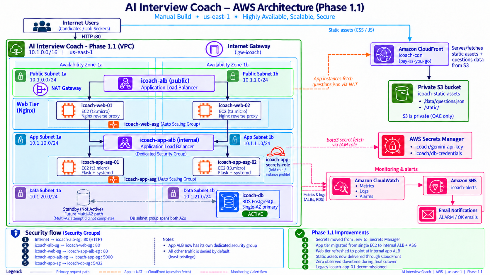

## Primary Request Flow

```text
Internet User
      |
      v
Internet-Facing Application Load Balancer
      |
      v
Web Tier - Nginx / Auto Scaling Group
      |
      v
Internal Application Load Balancer
      |
      v
App Tier - Flask / Auto Scaling Group
      |
      v
Amazon RDS PostgreSQL
```

## Question Bank Flow

```text
Private App EC2
      |
      v
NAT Gateway
      |
      v
Amazon CloudFront
      |
      v
Private Amazon S3 Bucket
      |
      v
data/questions.json
```

## Static Asset Flow

```text
Browser
      |
      v
Amazon CloudFront
      |
      v
Private Amazon S3 Bucket
      |
      v
static/v2/style.css
static/v2/script.js
```

## Secrets Flow

```text
App EC2
      |
      v
IAM Instance Role
      |
      v
AWS Secrets Manager
      |
      v
Gemini API Key
Database Credentials
```

## Monitoring Flow

```text
AWS Resource / Metric
      |
      v
Amazon CloudWatch
      |
      v
CloudWatch Alarm
      |
      v
Amazon SNS
      |
      v
Email Notification
```

---

# Architecture at a Glance

| Layer | Implementation |
|---|---|
| Networking | Custom VPC with 6 subnets across 2 Availability Zones |
| Public Load Balancing | Internet-facing Application Load Balancer |
| Web Tier | Nginx EC2 instances in an Auto Scaling Group |
| App Load Balancing | Internal Application Load Balancer |
| App Tier | Flask EC2 instances in an Auto Scaling Group |
| Database | Private Amazon RDS PostgreSQL |
| Secrets | AWS Secrets Manager with EC2 IAM instance role |
| Content Delivery | Private S3 bucket behind CloudFront using OAC |
| Monitoring | CloudWatch alarms with SNS email notifications |
| Security | Security-group-to-security-group communication between tiers |
| Availability | Web and application tiers span 2 AZs; database remains Single-AZ |

---

# Networking

The infrastructure runs inside a custom VPC in `us-east-1`.

The VPC contains six subnets across two Availability Zones:

```text
Public Subnet 1a   10.1.0.0/24
Public Subnet 1b   10.1.1.0/24

App Subnet 1a      10.1.10.0/24
App Subnet 1b      10.1.11.0/24

Data Subnet 1a     10.1.20.0/24
Data Subnet 1b     10.1.21.0/24
```

The public subnets contain the internet-facing ALB and web tier.

The private application subnets contain the internal application ALB and application EC2 instances.

The private data subnets are used by Amazon RDS.

Private application instances use the NAT Gateway when outbound internet access is required.

---

# Web Tier - ALB and Auto Scaling

The web tier remains behind the internet-facing Application Load Balancer.

```text
Internet
   |
   v
Public ALB
   |
   v
Web Target Group
   |
   v
Nginx EC2 Instances
```

The web instances are managed by:

```text
icoach-web-asg
```

and span both public subnets.

Before Phase 1.1, Nginx forwarded application traffic directly to one private application EC2 address.

Phase 1.1 changed the Nginx upstream so traffic goes to the new internal application ALB instead.

The new web configuration was captured in:

```text
icoach-web-ami-v2
```

The web launch template was updated and an instance refresh was performed.

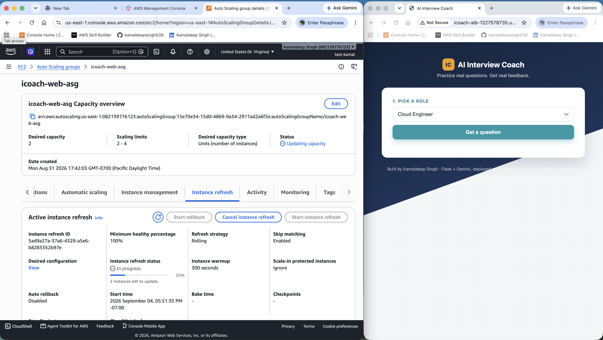

The refresh used a launch-before-terminate approach so replacement capacity could become healthy before existing instances were removed.

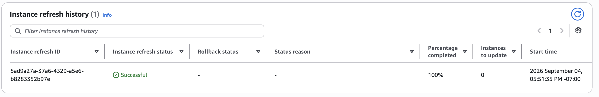

---

# Application Tier - Internal ALB and Auto Scaling

Phase 1 used one private application EC2 instance.

That created a single point of failure.

Phase 1.1 replaced that design with an internal ALB and an application Auto Scaling Group.

```text
Web Tier
   |
   v
Internal Application Load Balancer
   |
   v
icoach-app-tg
   |
   +-------------------+
   |                   |
   v                   v
App EC2             App EC2
AZ 1a               AZ 1b
```

The internal load balancer is:

```text
icoach-app-alb
```

It spans both private application subnets.

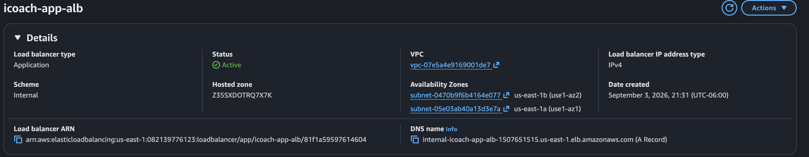

The application Auto Scaling Group is:

```text
icoach-app-asg
```

Configuration:

```text
Desired capacity: 2
Minimum capacity: 2
Maximum capacity: 4
```

The launch template uses:

```text
icoach-app-launch-template
```

with:

```text
icoach-app-ami-v1
t3.micro
icoach-app-secrets-role
```

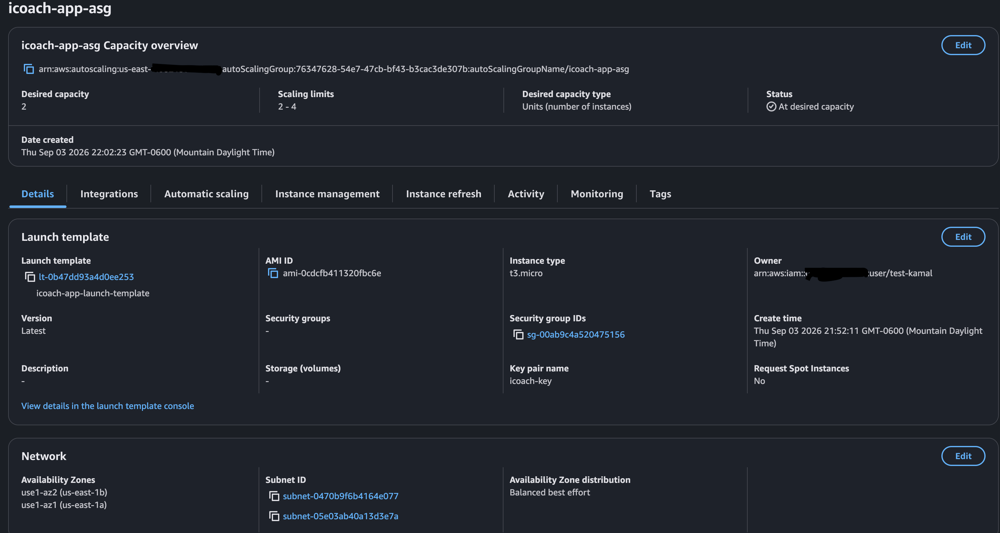

Both application targets were validated healthy behind the internal ALB.

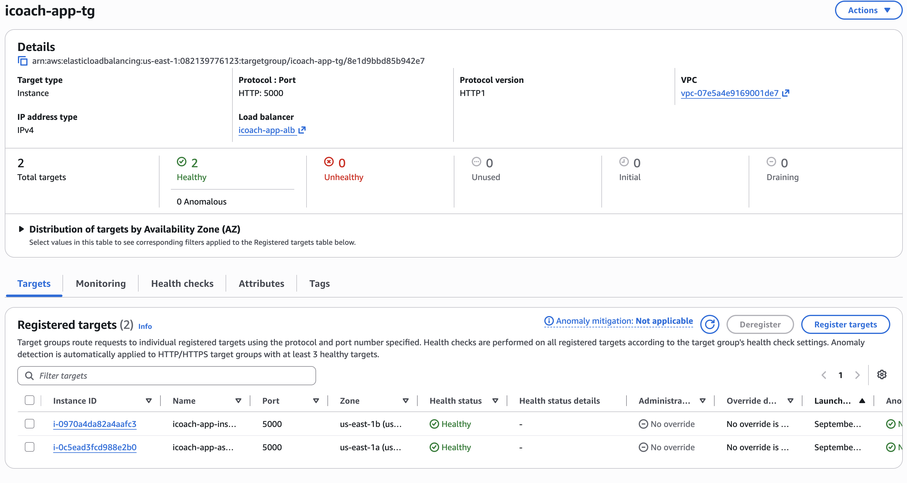

After the new application path was validated, the original standalone `icoach-app-01` instance was decommissioned.

---

# Secrets Manager and IAM

Phase 1 stored application credentials locally in a `.env` file.

Phase 1.1 moved those values into AWS Secrets Manager.

The application uses:

```text
icoach/gemini-api-key
```

and:

```text
icoach/db-credentials
```

The database secret contains:

```text
DB_HOST
DB_PORT
DB_NAME
DB_USER
DB_PASSWORD
```

Application instances use:

```text
IAM Policy: icoach-secrets-read-policy
IAM Role: icoach-app-secrets-role
Trusted Service: EC2
```

The IAM policy is scoped to the required secrets.

`app.py` retrieves the values at startup using `boto3` and the IAM role attached to the EC2 instance.

A `.env` fallback remains for local development only.

The real `.env` file is ignored by Git and is not stored in the repository.

Before changing the application traffic path, the new configuration was validated using a temporary instance.

Validation included:

- IAM-based secret retrieval
- application startup
- Gemini API request
- PostgreSQL connectivity
- successful session persistence

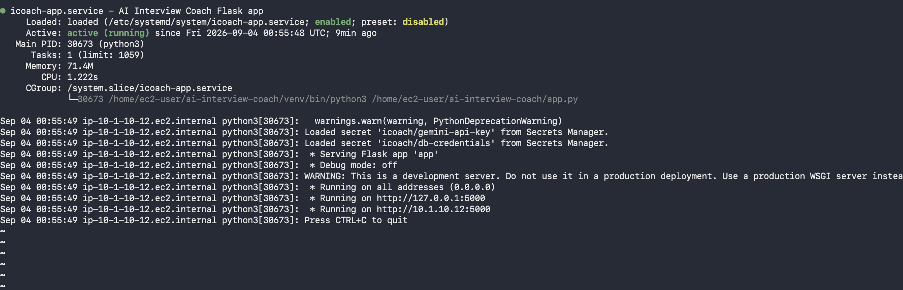

---

# Application-Level Changes

Phase 1.1 also required changes to the Flask application so it could use the new AWS infrastructure.

## Secrets Loaded at Startup

The application retrieves the required secrets from Secrets Manager during startup.

```python
def load_secret_into_env(secret_name):
    try:
        client = boto3.client("secretsmanager", region_name=AWS_REGION)
        response = client.get_secret_value(SecretId=secret_name)
        secret_values = json.loads(response["SecretString"])

        for key, value in secret_values.items():
            os.environ[key] = value

    except (ClientError, NoCredentialsError, EndpointConnectionError) as exc:
        print(
            f"Could not load '{secret_name}' from Secrets Manager, "
            f"falling back to .env: {exc}"
        )
```

On AWS, the IAM instance role provides permission to retrieve the secrets.

For local development, the application can fall back to the local `.env` configuration.

## Question Bank Through CloudFront

The main question bank is stored in:

```text
data/questions.json
```

inside the private S3 bucket.

The application retrieves the file through CloudFront:

```python
QUESTIONS_URL = "https://d1927xzamfh4ps.cloudfront.net/data/questions.json"
```

A small built-in fallback remains available if the remote question-bank request fails.

## Static Assets Through CloudFront

The application templates were updated to retrieve CSS and JavaScript from CloudFront.

```html
<link
  rel="stylesheet"
  href="https://d1927xzamfh4ps.cloudfront.net/static/v2/style.css"
/>

<script
  src="https://d1927xzamfh4ps.cloudfront.net/static/v2/script.js"
  defer>
</script>
```

The `v2` path separates the newer assets from the earlier static-file location.

## PostgreSQL Persistence

After Gemini returns feedback, the completed session is written to PostgreSQL.

```python
cur.execute(
    "INSERT INTO sessions "
    "(role, question, answer, feedback) "
    "VALUES (%s, %s, %s, %s)",
    (role, question, answer, feedback),
)
```

Database connection values come from the Secrets Manager database secret when the application runs on AWS.

---

# Final Application-Tier Migration

Before Phase 1.1, Nginx forwarded application traffic directly to the original EC2 private address.

```nginx
proxy_pass http://10.1.10.76:5000;
```

The new configuration forwards requests to the internal application ALB.

```nginx
proxy_pass http://internal-icoach-app-alb-1507651515.us-east-1.elb.amazonaws.com;
```

The change was validated using:

```text
nginx -t
```

followed by:

```text
systemctl reload nginx
```

and:

```text
curl -I http://localhost
```

The web tier returned:

```text
200 OK
```

The application was then validated through the public-facing ALB.

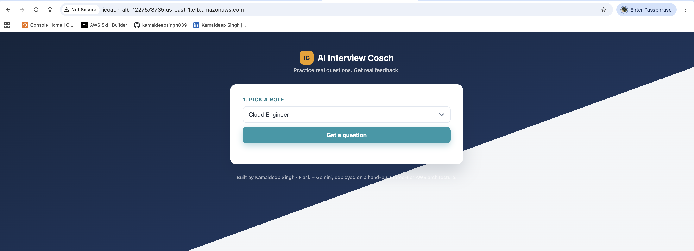

The final routing cutover completed with **zero observed downtime**.

This refers specifically to what was observed during the completed migration and does not mean the application is currently operating as an always-on public service.

---

# Security Groups

Phase 1.1 introduced a dedicated security group for the internal application ALB.

The final traffic path became:

```text
Internet
   |
   v
icoach-alb-sg
HTTP 80
   |
   v
icoach-web-sg
HTTP 80
   |
   v
icoach-app-alb-sg
TCP 5000
   |
   v
icoach-app-sg
PostgreSQL 5432
   |
   v
icoach-db-sg
```

The internal ALB and application EC2 instances therefore have separate security responsibilities.

The final application security group permits the required application path from the internal ALB and administrative SSH access from the web-tier security group.

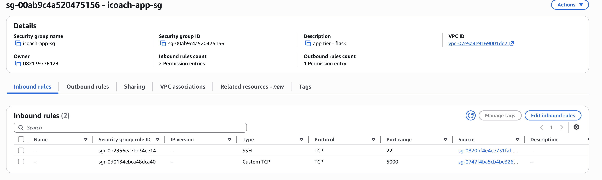

---

# Deployment Incident and Troubleshooting

During preparation for the application-tier migration, an existing security-group rule was accidentally overwritten instead of preserving the original path while the new path was being added.

The missing rule prevented the web tier from reaching the original application instance on port `5000`.

CloudWatch detected the resulting unhealthy targets and SNS generated an ALARM notification.

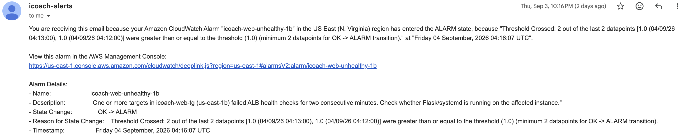

The problem was isolated layer by layer.

First, the application service was checked:

```text
systemctl status icoach-app
```

The service was running.

Nginx was then tested locally:

```text
curl -I http://localhost
```

The result was:

```text
504 Gateway Timeout
```

Direct connectivity from the web tier to the application was then tested:

```text
curl -v http://<app-private-ip>:5000
```

The request timed out.

The security-group rules were inspected and the missing web-to-app inbound rule was identified.

After restoring the rule, recovery was validated through:

- direct connectivity
- target-group health
- application access
- CloudWatch alarm recovery
- SNS recovery notification

The main lesson from the incident was:

> **Add the new path first, validate it end to end, then remove the old path.**

That approach was used during the remaining migration work.

---

# Failure and Recovery Testing

After the application Auto Scaling Group was established, one ASG-managed application instance was deliberately terminated.

The expected sequence was:

```text
App instance terminated
      |
      v
Healthy target count drops
      |
      v
ASG detects missing capacity
      |
      v
Replacement EC2 launches
      |
      v
Health checks pass
      |
      v
Target group returns to healthy capacity
```

The replacement instance was launched automatically.

No manual EC2 replacement was required.

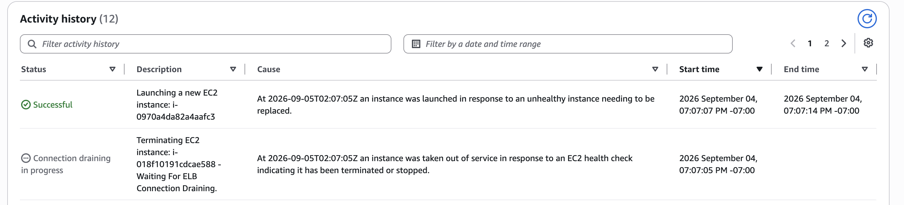

This validated that the application tier no longer depended on one permanent EC2 instance.

The security-group incident and the Auto Scaling test were separate events:

```text
Security-group outage
= accidental deployment failure

ASG instance termination
= deliberate resilience test
```

---

# Database - Amazon RDS PostgreSQL

The database remains a private Amazon RDS PostgreSQL deployment.

It is not publicly accessible.

Application traffic reaches the database through the application-tier security group on PostgreSQL port `5432`.

The DB subnet group spans both private data subnets:

```text
Data Subnet 1a - 10.1.20.0/24
Data Subnet 1b - 10.1.21.0/24
```

Multi-AZ was evaluated during Phase 1.1.

However, the AWS account/free-plan restrictions did not allow the standby instance to be enabled within the current setup.

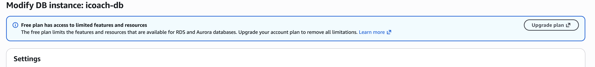

The Multi-AZ standby option was therefore unavailable.

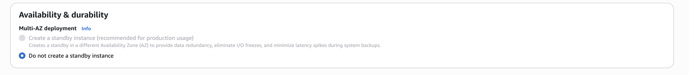

The database remains Single-AZ in this phase.

No successful database failover is claimed because no standby database instance was enabled.

---

# S3 and CloudFront

The S3 bucket remains private.

It stores the question bank and application static assets.

```text
data/questions.json

static/v2/style.css

static/v2/script.js
```

CloudFront accesses the private S3 bucket through Origin Access Control.

The application retrieves the question bank through CloudFront rather than directly from S3.

Browser CSS and JavaScript are also delivered through CloudFront.

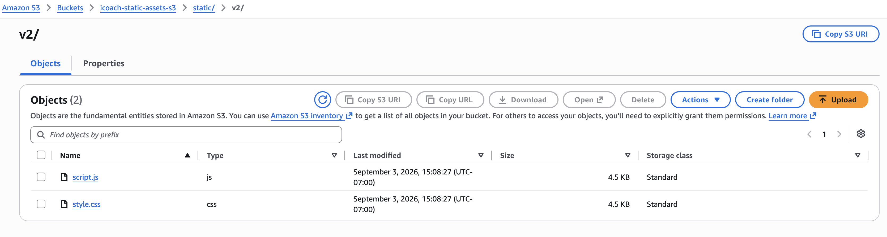

This keeps the S3 bucket private while still allowing required application content to be delivered.

---

# Monitoring and Alerting

Amazon CloudWatch and Amazon SNS were used to monitor health and report failures.

```text
AWS Resource / Metric
      |
      v
CloudWatch Alarm
      |
      v
Amazon SNS
      |
      v
Email Notification
```

The security-group incident provided a real validation of this monitoring path.

When connectivity failed, CloudWatch detected the unhealthy web targets and SNS delivered ALARM notifications.

After connectivity was restored and health checks recovered, the alarms returned to the OK state.

---

# Resource Tagging

AWS resources were tagged consistently during the manual build.

Examples include:

```text
Project   = icoach
ManagedBy = manual
Tier      = public / private
```

The goal of tagging was to make it easier to:

- identify resources belonging to the project
- understand resource purpose
- separate infrastructure tiers
- troubleshoot problems
- review costs
- prepare for future Terraform management

---

# Validation

Phase 1.1 was validated through:

- application access through the public ALB during deployment testing
- healthy web-tier targets
- healthy application-tier targets
- application ASG maintaining desired capacity
- internal ALB routing to both application instances
- IAM-based Secrets Manager retrieval
- successful Gemini API request
- PostgreSQL session persistence
- question-bank retrieval through CloudFront
- static asset delivery through CloudFront
- Nginx routing through the internal application ALB
- successful web Auto Scaling Group instance refresh
- legacy standalone application EC2 decommissioning
- deliberate application-instance termination
- automatic ASG replacement
- application target-group recovery
- CloudWatch detection of the security-group failure
- SNS ALARM notification
- recovery validation
- final application-tier cutover with zero observed downtime

---

# Known Gaps

Phase 1.1 improved the reliability and security of the application tier, but the environment is not presented as a finished production platform.

Remaining gaps include:

- HTTPS is not implemented on the public ALB
- a custom domain is not implemented
- RDS remains Single-AZ
- Terraform has not yet replaced the manual AWS build
- Docker has not yet been added
- CI/CD has not yet been added
- Kubernetes / EKS has not yet been added

A future improvement is to introduce a private DNS alias for the internal application ALB rather than coupling Nginx directly to the AWS-generated ALB hostname.

Nginx DNS-resolution behavior can also be configured more deliberately for hostname-based upstreams.

---

# Technology Stack

## AWS

- Amazon VPC
- Amazon EC2
- Application Load Balancer
- EC2 Auto Scaling
- Launch Templates
- Amazon RDS PostgreSQL
- Amazon S3
- Amazon CloudFront
- AWS Secrets Manager
- AWS IAM
- Amazon CloudWatch
- Amazon SNS
- Internet Gateway
- NAT Gateway

## Application / OS

- Python
- Flask
- Gemini API
- boto3
- PostgreSQL
- Nginx
- systemd
- Amazon Linux 2023

---

# Project Status

## Phase 1.1 - Complete

The Phase 1.1 infrastructure was manually built, migrated, tested, troubleshot, hardened, and validated.

The screenshots in this repository document the AWS environment and validation performed during this phase.

The application is not currently being presented as an always-on public service.

## Next Milestone

Rebuild the validated Phase 1.1 architecture using **Terraform**.

The goal of Phase 2 is not to redesign the architecture.

The goal is to translate the manually built infrastructure into repeatable Infrastructure as Code.

```text
Manual AWS Build
      |
      v
Terraform
      |
      v
Docker
      |
      v
CI/CD
      |
      v
Kubernetes / EKS
```

---

**Built and documented by Kamaldeep Singh - August-September 2026**
